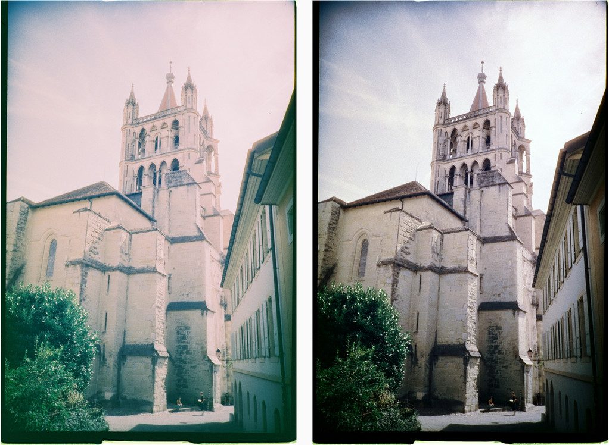
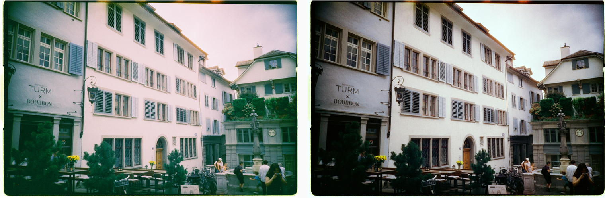
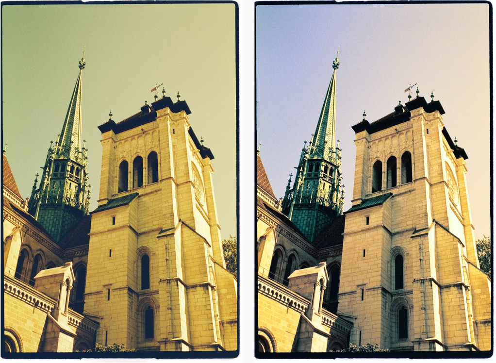
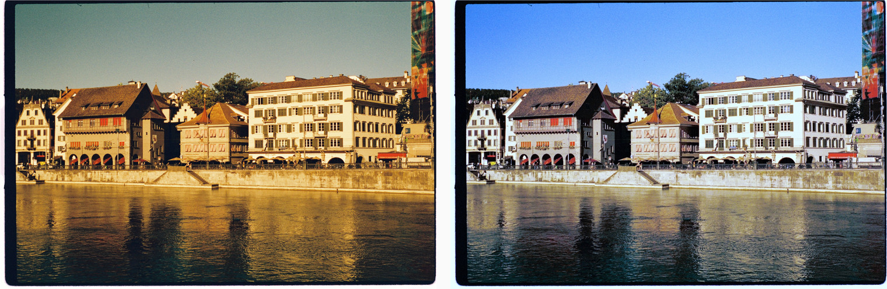

# Emulsion Profile Correction Toolkit

## Overview

Scanning software turns a colour negative into a positive using a profile for
that particular film. SilverFast's NegaFix and lab scanners only have profiles
for common stocks, so anything unusual gets scanned as if it were Kodak Gold or
Ultramax and comes back as a poor Kodak emulation, washed out and colour
shifted. This toolkit corrects those scans afterwards. Each supported film has
a profile describing how its scans go wrong, and the correction looks at the
whole roll at once, since most of the scanning error is common to every frame
while the subjects change. What the lab got wrong on one frame in particular
is then taken out frame by frame.

## Usage

You need Ruby 4.0 or later and [libvips](https://www.libvips.org/)
(`dnf install vips`, `apt install libvips` or `brew install vips`), then
`bundle install`. Point it at a folder of scans and name the film:

```bash
./bin/emulsion --profile lomochrome-color-92 ~/scans/"47791 Lomography Color 92"
```

Corrected copies go to a new folder beside the original, in the format the
scans came in, and the originals are never touched. `--help` lists every
setting, any of which can be overridden, and `--profile` also takes the path
to a profile file of your own for a film that isn't listed here.

`bundle exec rake` runs the tests.

## Correcting toward a reference film

Some films are corrected by comparison with another film that the lab scans
properly. The toolkit measures what neutral surfaces look like at each
brightness and bends each channel until they match how the reference film
renders them, in three layers:

- the film's own cast, measured once from several of its rolls and kept in
  its profile, so a roll that happens to be all warm sandstone or all blue
  sky cannot pass its scenery off as a cast;
- how far each roll's lab session drifted from that, up to about a stop;
- how far the lab's balance drifted on each frame, fitted as a gentle shift
  and tilt across the tones, and held back further on films whose frames
  hardly drift, so a frame full of leaves is not read as a green cast.

Stretching a frame's black and white points multiplies whatever tint is left
in it, so a balance that lands on the reference at this stage lands warm in
the finished picture. The roll's balance is therefore checked through the
whole correction on a few frames and nudged until the greys come out right at
the end.

Where a film's tones come back bunched together, each roll's tones are also
bent toward where the reference film's fall.

The reference in `references/fujifilm-superia.yml` was measured from seven
rolls of Superia 200 and 400, shot in the same places and light as the rolls
the Phoenix and Lucky profiles were built from. To measure a reference of
your own from rolls a lab scanned well:

```bash
bundle exec ruby tools/measure_reference.rb my-film "My Film 400" ~/scans/roll1 ~/scans/roll2
```

Then name it in a profile with `reference: my-film`, or pass
`--reference my-film` on the command line. To measure a film's own cast into
its profile, from as many and as varied rolls as you have:

```bash
bundle exec ruby tools/measure_film.rb lucky-shd-400 ~/scans/roll1 ~/scans/roll2 ~/scans/roll3
```

## Beyond the film

Everything above is about the film and the profile it was scanned with. Some
of what is wrong with a scan is not: the camera's corners are dark, the
scanner left its borders in the file, the frame holds more at each end than
the range it was given. Those corrections are off unless `--fix` asks for
them, so the film profiles stay purely about emulsion.

```bash
./bin/emulsion --profile lucky-shd-400 --fix ~/scans/"49602 Lucky SHD 400"
```

A bare `--fix` turns on the usual set, `--fix all` turns on everything, and
`--fix crop,shadows` names the ones you want.

- `crop` trims the scanner's overscan and the film rebate around the picture.
- `floor` reads each frame's black floor off that rebate. It is the scanner's
  own rendering of unexposed film, which beats guessing the floor from the
  picture, and it follows the lab's balance as it drifts from frame to frame.
- `flat` measures how much light the corners lose, across the whole roll so
  the subjects cancel out, and gives it back. Each channel is measured on its
  own, since corners usually lose colour along with light.
- `shadows` opens crushed shadows and pulls back held highlights, by as much
  as each frame has to give, and estimates channels that clipped at white
  from the ones that survived.
- `sharpen` and `grain` work from how sharp and how grainy each frame
  measures against its own grain floor.

Both `crop` and `floor` need the film's own edges in the scan. A lab that
crops to the picture leaves none, in which case both stand aside and the
black floor is measured from the frames as before.

## Film stocks

### [LomoChrome Color '92](https://shop.lomography.com/eu/lomochrome-color-92-35-mm-iso-400) (`lomochrome-color-92`)

An ISO 400 colour negative film from Lomography, with heavy grain and a
desaturated, vintage colour look. Scans of it come back yellow shifted and
chroma compressed: the colour is squeezed toward grey, the shadows go yellow,
skies turn purple and foliage olive, even though the whites stay neutral. They
are also flat, with the blacks lifted to a dark grey and the whites held back,
and the grain carries a magenta speckle.


*Before, after. Same frames.*

### Harman Phoenix I 200 (`harman-phoenix-200`)

Harman's ISO 200 colour negative film, grainy and contrasty, with strong
halation. Scans of it come back with a teal floor under the shadows: green
and blue sit 20 to 35 levels above black while red is clipped, so every
shadow goes green. The highlights tip pink and come back bunched near white,
with the midtones pushed up to meet them, so frames look washed out even once
their black and white points are stretched. The profile balances each roll
toward Superia and gives it Superia's tonal spread.





*Before, after. Same frames.*

### Lucky SHD 400 (`lucky-shd-400`)

Lucky's ISO 400 colour negative film. Scans of it look shot through a yellow
filter: blue sags two to three stops behind green through the upper midtones
while the whites stay clean, and red rides a little high, so pale blues and
cyans turn yellow.





*Before, after. Same frames.*

## Licence

[PolyForm Noncommercial 1.0.0](LICENSE.md): free to use, change and share for
non-commercial purposes, but not for commercial use.
