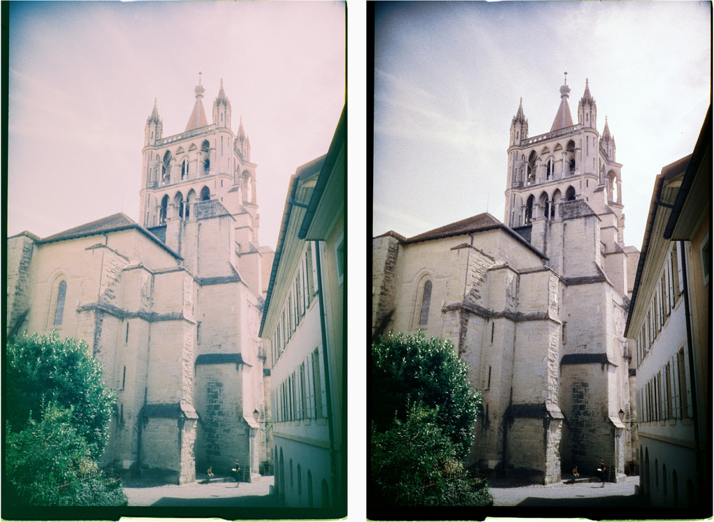
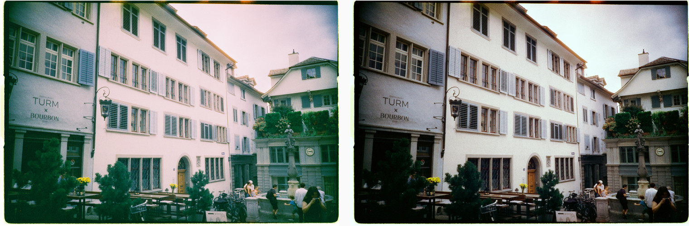
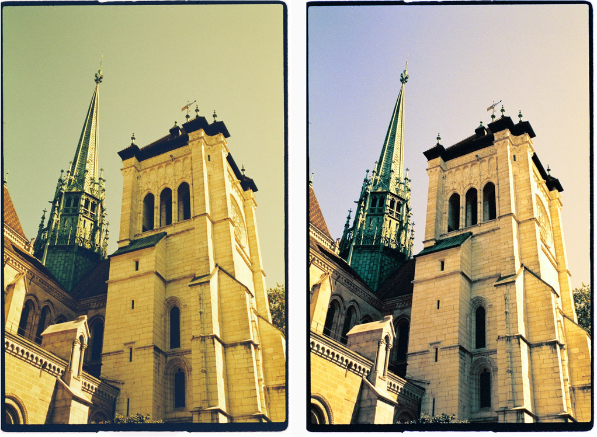
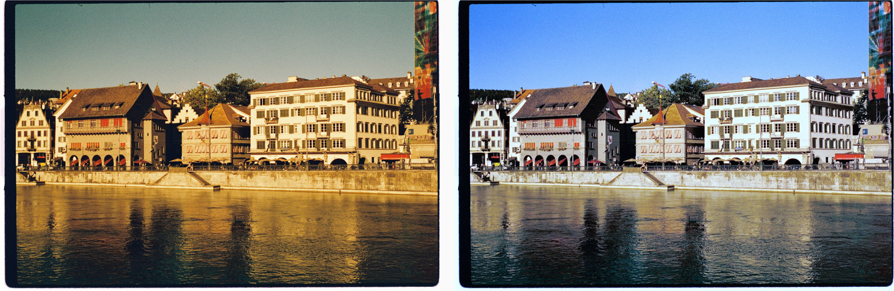

# Emulsion Profile Correction Toolkit

A command-line tool for fixing colour casts, flat contrast and colour noise in
lab scans of colour negative film.

Labs don't always have a scanning profile for the film you've shot. Using a
profile for another stock can leave the scans washed out or with odd colours.
This toolkit corrects those scans using a profile for the film. It measures the
whole roll first, then adjusts each frame.

## Install

You'll need Ruby 4.0 or later, Bundler and [libvips](https://www.libvips.org/).
Install libvips with your package manager (`brew install vips` on macOS), then
run this from the project directory:

```sh
bundle install
```

## Usage

Put the scans from one roll in a folder and choose a film profile:

```sh
bundle exec ./bin/emulsion --profile lomochrome-color-92 ~/scans/my-roll
```

It reads TIFF, JPEG and PNG files. Corrected copies go to
`~/scans/my-roll - corrected`, using the same file format as the originals.
The originals are left alone. The output folder also gets a `settings.yml`
with the settings used for the run.

For previews and a contact sheet:

```sh
bundle exec ./bin/emulsion --profile lomochrome-color-92 \
  --previews --contact-sheet --gentle ~/scans/my-roll
```

Some useful options:

| Option | What it does |
| --- | --- |
| `--out DIR` | Choose the output folder. |
| `--previews` | Save 1600px JPEG previews in a `preview/` subfolder. |
| `--contact-sheet` | Save a numbered contact sheet as `contact.jpg`. |
| `--gentle` | Use half the CPU cores at low priority. |
| `--threads N` | Set the number of threads used for image processing. |
| `--only GLOB` | Process matching frames, e.g. `--only '0000[45]*'`. |
| `--explain` | Report the scan problems detected in the roll, without writing images. |
| `--audit` | Also report how the chosen profile handles those problems. |
| `--overrides FILE` | Load per-frame settings from YAML, keyed by filename without its extension. |

By default, image processing uses all CPU cores. Command-line settings override
the profile. Run `bundle exec ./bin/emulsion --help` for the full list, including
colour, contrast and grain controls.

## Output formats

Use `--format` to choose `tiff`, `jpeg`, `png`, `heic` or `jp2`:

```sh
bundle exec ./bin/emulsion --profile lucky-shd-400 \
  --format tiff --bits 16 ~/scans/my-roll
```

TIFF, PNG and JPEG 2000 default to 16 bits per channel; JPEG and HEIC default
to 8. Use `--bits` to change the depth where the format supports it. Eight-bit
output is dithered to reduce banding in gradients.

`--quality` defaults to 98. Setting it to 100 produces lossless HEIC or JPEG
2000 output. Support for these formats depends on your libvips build.

HEIC defaults to 8 bits because higher depths gave worse results with the
tested encoder. If your libvips build can't read the resulting HEIC files back,
`--previews` gives you JPEGs to browse.

## Extra fixes

The film profiles handle colour and tone. Use `--fix` to also crop scan borders,
recover shadows and highlights, or sharpen soft frames:

```sh
bundle exec ./bin/emulsion --profile lucky-shd-400 \
  --fix crop,shadows ~/scans/my-roll
```

`--fix` on its own enables the default set. `--fix all` enables every available
fix, or you can pass a comma-separated list:

| Fix | What it does |
| --- | --- |
| `crop` | Trim scanner overscan and film borders. |
| `floor` | Use the film border to estimate the frame's black level. |
| `flat` | Lift dark corners. Also needs a nonzero `--flat-field` setting. |
| `shadows` | Recover shadow and highlight detail where possible. |
| `sharpen` | Sharpen frames that measure as soft. |
| `grain` | Adjust colour noise reduction to the frame's measured grain. |

`crop` and `floor` need visible film borders. If the lab already cropped them
off, these fixes are skipped. Corner correction is disabled in all bundled
profiles because it can add coloured halos to skies.

## Supported films

The examples below show the original scan on the left and the corrected version
on the right.

### LomoChrome Color '92 (`lomochrome-color-92`)

Corrects colour casts, weak saturation, flat contrast and magenta colour noise.


### Harman Phoenix I 200 (`harman-phoenix-200`)

Corrects green shadows, pink highlights and washed-out tones, using Fujifilm
Superia as a reference for colour balance and contrast.





### Lucky SHD 400 (`lucky-shd-400`)

Corrects the strong yellow cast caused by weak blue midtones, with extra colour
correction for warm subjects and bright skies.





## Custom profiles

Profiles are YAML files in [profiles/](profiles/). To try another film, copy an
existing profile, adjust its settings and pass the file path:

```sh
bundle exec ./bin/emulsion --profile ./my-film.yml ~/scans/my-roll
```

The bundled profiles use [Fujifilm Superia](references/fujifilm-superia.yml) as
a reference, measured from seven rolls of Superia 200 and 400. The toolkit
compares neutral colours at different brightness levels, corrects the film's
measured cast, then adjusts for differences between rolls and individual frames.
Profiles can also use the reference's tonal distribution to adjust contrast.

<details>
<summary>Measuring a reference or film profile</summary>

To make a reference from rolls that your lab scans well:

```sh
bundle exec ruby tools/measure_reference.rb my-film "My Film 400" \
  ~/scans/reference-roll1 ~/scans/reference-roll2
```

This writes `references/my-film.yml`. Set `reference: my-film` in a profile, or
pass `--reference my-film` when running the toolkit.

To measure a film's colour cast, use several rolls with varied subjects:

```sh
bundle exec ruby tools/measure_film.rb lucky-shd-400 \
  ~/scans/roll1 ~/scans/roll2 ~/scans/roll3
```

This updates `film_gains` in the profile. To measure colour differences that
remain after that correction:

```sh
bundle exec ruby tools/measure_shape.rb lucky-shd-400 \
  --reference ~/scans/superia-roll ~/scans/lucky-roll
```

This updates `chroma_map` in the profile; `chroma_shape` controls its strength.
Both measurement tools edit the profile in `profiles/`.

</details>

## Tests

```sh
bundle exec rake
```

## Licence

[PolyForm Noncommercial 1.0.0](LICENSE.md). Free to use, modify and share for
non-commercial purposes.
